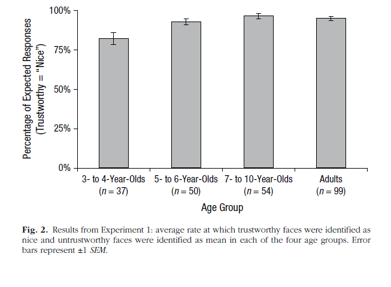
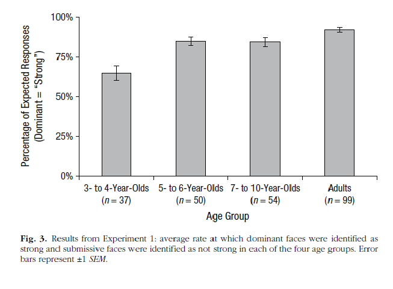
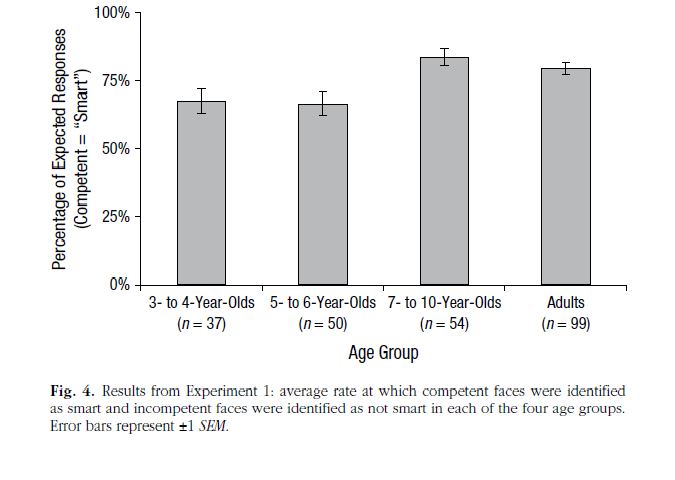

# Report Details

```{r}
articleID <- "9-5-2014_PS" # insert the article ID code here e.g., "10-3-2015_PS"
reportType <- 'final'
pilotNames <- "Kari Leibowitz, Yochai Shavit" # insert the pilot's name here e.g., "Tom Hardwicke". If there are multiple pilots enter both names in a character string e.g., "Tom Hardwicke, Bob Dylan"
copilotNames <- "Kyle MacDonald, Tom Hardwicke" # insert the co-pilot's name here e.g., "Michael Frank". If there are multiple co-pilots enter both names in a character string e.g., "Tom Hardwicke, Bob Dylan"
pilotTTC <- 300 # insert the pilot's estimated time to complete (in minutes, fine to approximate) e.g., 120
copilotTTC <- 450 # insert the co- pilot's estimated time to complete (in minutes, fine to approximate) e.g., 120
pilotStartDate <- as.Date("11/1/17", format = "%m/%d/%y") # insert the pilot's start date in US format e.g., as.Date("01/25/18", format = "%m/%d/%y")
copilotStartDate <- as.Date("6/15/18", format = "%m/%d/%y") # insert the co-pilot's start date in US format e.g., as.Date("01/25/18", format = "%m/%d/%y")
completionDate <- as.Date("09/07/18", format = "%m/%d/%y") # copilot insert the date of final report completion (after any necessary rounds of author assistance) in US format e.g., as.Date("01/25/18", format = "%m/%d/%y")
```

-------

#### Methods summary: 

In the present study, there were four age groups: 3-4 year olds (n=37), 5-6 year olds(n=50), 7-10 year olds (n=54) - tested in lab or at a local museum - and adults (n=99, tested online). Cogsdill et al. presented participants with pairs of faces that were pre-determined to be high (+3 s.d) or low (-3 s.d) in three traits: trustworthiness (measured as nice vs. mean), competence (measured as smart vs. not smart), or dominance (measured as strong vs. not strong). For each trait, 3 "high on trait" and 3 "low on trait" faces were selected and each pair consisted of one face that was a "high on trait" face and the other a "low on trait" face. All 9 possible iterations were presented to participants in a counter balanced order across traits. The authors assessed the ability of each age group's members to accurately identify which of two faces was high in a particular trait, by asking participants to indicate which of these two people is very nice/strong/smart. The authors were interested in the consistency of judgements across age groups in terms of the ability to "correctly" identify traits of faces based on a pre-determined consensus. 

------

#### Target outcomes: 

For this article we focused on the findings reported in the results section of Experiment 1.

Specifically, we attempted to reproduce all descriptive and inferential analyses reported in the text below and associated tables/figures (broken down by procedure):

> Figures 2, 3, and 4 summarize results for all age groups and traits; higher percentages of expected responses (i.e., those predicted on the basis of prior data--e.g., that trustworthy faces would be identified as nice and untrustworthy faces as mean) indicate stronger consensus. Combined, all four age groups showed significant consensus compared with chance (50%) when identifying faces as mean or nice (93%; Fig. 2), strong or not strong (85%; Fig. 3), and smart or not smart (76%; Fig. 4). Critically, all age groups attributed all three traits with significant consensus, ps < .001, ds > 1.08. However, an analysis of variance (ANOVA) revealed a significant main effect of age group, F(3, 236) = 17.91, p < .001. Although 3- to 4-year-olds responded with robust and adult like consensus (72% across all traits), they were less consistent than 5- to 6-year-olds (81%), 7- to 10-year-olds (88%), and adults (89%). One-way ANOVAs followed by post hoc tests with Sidak corrections for multiple comparisons were used to analyze age differences for each trait. These analyses revealed that when attributing both trustworthiness and dominance, 3- to 4-year-olds were less consistent than all other age groups (all ps < .01, ds > 0.59), which exhibited equivalent consistency (all ps > .23, ds < 0.40).

------

```{r global_options, include=FALSE}
knitr::opts_chunk$set(echo=TRUE, warning=FALSE, message=FALSE)
```

# Step 1: Load packages

```{r}
library(tidyverse) # for data munging
library(knitr) # for kable table formating
library(haven) # import and export 'SPSS', 'Stata' and 'SAS' Files
library(readxl) # import excel files
library(ReproReports) # custom report functions
library(effsize) #used to calculate effect size
library(car)
library(lsr) # using this to get effect sizes
library(broom)
```

```{r}
# Prepare report object. This will be updated automatically by the reproCheck function each time values are compared.
reportObject <- data.frame(dummyRow = TRUE, reportedValue = NA, obtainedValue = NA, valueType = NA, 
                           percentageError = NA, comparisonOutcome = NA, eyeballCheck = NA)
```

# Step 2: Load data

```{r}
d <- read_xlsx("DATA/Cogsdill_FaceTrait_Experiment1Public_04Feb14.xlsx")
```

# Step 3: Tidy data

Clean up column names and gather the ratings for each age group.

```{r}
colnames(d) <- colnames(d) %>% 
  str_replace(pattern = " ", "_") %>%
  str_to_lower()

d_tidy <- d %>% gather(key = attribute, value = rating, nice:smart)
```

# Step 4: Run analysis

## Descriptive statistics

Compute summary statisics for each age group and attribute.

```{r}
ms <- d_tidy %>% 
  group_by(age_group, attribute) %>% 
  summarise(m = mean(rating),
            stdev = sd(rating),
            n = n(),
            sem = stdev / sqrt(n))

ms %>% kable(digits = 2)
```

### Reproduce Figure 2



```{r figure 2}
ms %>% 
  filter(attribute == "nice") %>% 
  ggplot(aes(x = age_group, y = m)) +
  geom_bar(stat = "identity", fill="grey", color="black", width = 0.5) +
  geom_errorbar(aes(ymin = m - sem, ymax= m + sem), width=0.2)+
  ylim(0,1)+
  theme_bw()+
  labs(x="Age Group", y="Percent expected responses (Trustworthy='Nice')")+
  ggtitle("figure 2 reproduced: 'nice' by Age group")
```

Add eyeball repro checks for the mean values in Figure 2.

```{r}
grp34 <- ms %>% filter(attribute == 'nice', age_group == '3-4 year olds') %>% pull(m)
grp34_sem <- ms %>% filter(attribute == 'nice', age_group == '3-4 year olds') %>% pull(sem)
reportObject <- reproCheck(reportedValue = "fig", obtainedValue = grp34, valueType = 'mean', eyeballCheck = TRUE)
reportObject <- reproCheck(reportedValue = "fig", obtainedValue = grp34_sem, valueType = 'se', eyeballCheck = TRUE)

grp56 <- ms %>% filter(attribute == 'nice', age_group == '5-6 year olds') %>% pull(m)
grp56_sem <- ms %>% filter(attribute == 'nice', age_group == '5-6 year olds') %>% pull(sem)
reportObject <- reproCheck(reportedValue = "fig", obtainedValue = grp56, valueType = 'mean', eyeballCheck = TRUE)
reportObject <- reproCheck(reportedValue = "fig", obtainedValue = grp56_sem, valueType = 'se', eyeballCheck = TRUE)

grp710 <- ms %>% filter(attribute == 'nice', age_group == '7-10 year olds') %>% pull(m)
grp710_sem <- ms %>% filter(attribute == 'nice', age_group == '7-10 year olds') %>% pull(sem)
reportObject <- reproCheck(reportedValue = "fig", obtainedValue = grp710, valueType = 'mean', eyeballCheck = TRUE)
reportObject <- reproCheck(reportedValue = "fig", obtainedValue = grp710_sem, valueType = 'se', eyeballCheck = TRUE)

grpAdult <- ms %>% filter(attribute == 'nice', age_group == 'Adults') %>% pull(m)
grpAdult_sem <- ms %>% filter(attribute == 'nice', age_group == 'Adults') %>% pull(sem)
reportObject <- reproCheck(reportedValue = "fig", obtainedValue = grpAdult, valueType = 'mean', eyeballCheck = TRUE)
reportObject <- reproCheck(reportedValue = "fig", obtainedValue = grpAdult_sem, valueType = 'se', eyeballCheck = TRUE)
```

Reproducing this finding:

> "Combined, all four age groups showed significant consensus compared with chance (50%) when identifying faces as mean or nice (93%; Fig. 2)... Cogsdill et al., page 1134"

```{r niceness average}
mean_nice <- d_tidy %>% filter(attribute == "nice") %>% pull(rating) %>% mean()
reportObject <- reproCheck(reportedValue = "0.93", obtainedValue = mean_nice, valueType = 'mean')
```

### Reproduce Figure 3 



```{r figure 3}
ms %>% 
  filter(attribute == "strong") %>% 
  ggplot(aes(x = age_group, y = m)) +
  geom_bar(stat = "identity", fill="grey", color="black", width = 0.5) +
  geom_errorbar(aes(ymin = m - sem, ymax = m + sem), width=0.2)+
  ylim(0,1)+
  theme_bw()+
  labs(x="Age Group", y="Percent expected responses (Dominant='Nice')")+
  ggtitle("figure 2 reproduced: 'strong' by Age group")
```

Add eyeball repro checks for the mean values in Figure 3.

```{r}
grp34 <- ms %>% filter(attribute == 'strong', age_group == '3-4 year olds') %>% pull(m)
grp34_sem <- ms %>% filter(attribute == 'strong', age_group == '3-4 year olds') %>% pull(sem)
reportObject <- reproCheck(reportedValue = "fig", obtainedValue = grp34, valueType = 'mean', eyeballCheck = TRUE)
reportObject <- reproCheck(reportedValue = "fig", obtainedValue = grp34_sem, valueType = 'se', eyeballCheck = TRUE)

grp56 <- ms %>% filter(attribute == 'strong', age_group == '5-6 year olds') %>% pull(m)
grp56_sem <- ms %>% filter(attribute == 'strong', age_group == '5-6 year olds') %>% pull(sem)
reportObject <- reproCheck(reportedValue = "fig", obtainedValue = grp56, valueType = 'mean', eyeballCheck = TRUE)
reportObject <- reproCheck(reportedValue = "fig", obtainedValue = grp56_sem, valueType = 'se', eyeballCheck = TRUE)

grp710 <- ms %>% filter(attribute == 'strong', age_group == '7-10 year olds') %>% pull(m)
grp710_sem <- ms %>% filter(attribute == 'strong', age_group == '7-10 year olds') %>% pull(sem)
reportObject <- reproCheck(reportedValue = "fig", obtainedValue = grp710, valueType = 'mean', eyeballCheck = TRUE)
reportObject <- reproCheck(reportedValue = "fig", obtainedValue = grp710_sem, valueType = 'se', eyeballCheck = TRUE)

grpAdult <- ms %>% filter(attribute == 'strong', age_group == 'Adults') %>% pull(m)
grpAdult_sem <- ms %>% filter(attribute == 'strong', age_group == 'Adults') %>% pull(sem)
reportObject <- reproCheck(reportedValue = "fig", obtainedValue = grpAdult, valueType = 'mean', eyeballCheck = TRUE)
reportObject <- reproCheck(reportedValue = "fig", obtainedValue = grpAdult_sem, valueType = 'se', eyeballCheck = TRUE)
```

Next, we try to reproduce this finding:

> "Combined, all four age groups showed significant consensus compared with chance (50%) when identifying faces as...strong or not strong (85%; Fig. 3)... Cogsdill et al., page 1134"

```{r niceness average 2}
mean_strong <- d_tidy %>% filter(attribute == "strong") %>% pull(rating) %>% mean()
reportObject <- reproCheck(reportedValue = "0.85", obtainedValue = mean_strong, valueType = 'mean')
```

### Reproduce Figure 4



```{r figure 4}
ms %>% 
  filter(attribute == "smart") %>% 
  ggplot(aes(x = age_group, y = m)) +
  geom_bar(stat = "identity", fill="grey", color="black", width = 0.5) +
  geom_errorbar(aes(ymin = m - sem, ymax = m + sem), width=0.2)+
  ylim(0,1)+
  theme_bw()+
  labs(x="Age Group", y="Percent expected responses (Competent='Smart')")+
  ggtitle("figure 2 reproduced: 'smart' by Age group")
```

Add eyeball repro checks for the mean values in Figure 3.

```{r}
grp34 <- ms %>% filter(attribute == 'smart', age_group == '3-4 year olds') %>% pull(m)
grp34_sem <- ms %>% filter(attribute == 'smart', age_group == '3-4 year olds') %>% pull(sem)
reportObject <- reproCheck(reportedValue = "fig", obtainedValue = grp34, valueType = 'mean', eyeballCheck = TRUE)
reportObject <- reproCheck(reportedValue = "fig", obtainedValue = grp34_sem, valueType = 'se', eyeballCheck = TRUE)

grp56 <- ms %>% filter(attribute == 'smart', age_group == '5-6 year olds') %>% pull(m)
grp56_sem <- ms %>% filter(attribute == 'smart', age_group == '5-6 year olds') %>% pull(sem)
reportObject <- reproCheck(reportedValue = "fig", obtainedValue = grp56, valueType = 'mean', eyeballCheck = TRUE)
reportObject <- reproCheck(reportedValue = "fig", obtainedValue = grp56_sem, valueType = 'se', eyeballCheck = TRUE)

grp710 <- ms %>% filter(attribute == 'smart', age_group == '7-10 year olds') %>% pull(m)
grp710_sem <- ms %>% filter(attribute == 'smart', age_group == '7-10 year olds') %>% pull(sem)
reportObject <- reproCheck(reportedValue = "fig", obtainedValue = grp710, valueType = 'mean', eyeballCheck = TRUE)
reportObject <- reproCheck(reportedValue = "fig", obtainedValue = grp710_sem, valueType = 'se', eyeballCheck = TRUE)

grpAdult <- ms %>% filter(attribute == 'smart', age_group == 'Adults') %>% pull(m)
grpAdult_sem <- ms %>% filter(attribute == 'smart', age_group == 'Adults') %>% pull(sem)
reportObject <- reproCheck(reportedValue = "fig", obtainedValue = grpAdult, valueType = 'mean', eyeballCheck = TRUE)
reportObject <- reproCheck(reportedValue = "fig", obtainedValue = grpAdult_sem, valueType = 'se', eyeballCheck = TRUE)
```

Next, we try to reproduce this finding:

> "Combined, all four age groups showed significant consensus compared with chance (50%) when identifying faces as...smart or not smart (76%; Fig. 4). Cogsdill et al., page 1134"

```{r smartness average}
mean_smart <- d_tidy %>% filter(attribute == "smart") %>% pull(rating) %>% mean()
reportObject <- reproCheck(reportedValue = "0.76", obtainedValue = mean_smart, valueType = 'mean')
```

### Check consistency across age groups

> "Although 3- to 4-year-olds responded with robust and adult like consensus (72% across all traits), they were less consistent than 5- to 6-year-olds (81%), 7- to 10-year-olds (88%), and adults (89%). Cogsdill et al., page 1134"

```{r consistency by age group across traits}
by_age_ms <- d_tidy %>% 
  group_by(age_group) %>% 
  summarise(m = mean(rating)) 

by_age_ms %>% kable(digits = 2)
```

All consistent with statistics reported in paper. Add repro checks for these values. 

```{r}
reportObject <- reproCheck(reportedValue = "0.72", obtainedValue = by_age_ms$m[1], valueType = 'mean')
reportObject <- reproCheck(reportedValue = "0.81", obtainedValue =  by_age_ms$m[2], valueType = 'mean')
reportObject <- reproCheck(reportedValue = "0.88", obtainedValue =  by_age_ms$m[3], valueType = 'mean')
reportObject <- reproCheck(reportedValue = "0.89", obtainedValue =  by_age_ms$m[4], valueType = 'mean')
```

## Inferential statistics

Let's try reproducing this claim:

> "Combined, all four age groups showed significant consensus compared with chance (50%) when identifying faces as mean or nice , strong or not strong, and smart or not smart."

The authors did not report which test they used to come up with the conclusion that this percentage is significantly different from 50%. This was initially an insufficient information error. We contacted the original authors and they tell us that this was a t-test.

```{r one-sample t test aginst 0.5 all conditions and age groups}
# wrapper function for t-test
t_test_fun <- function(df) {
  m <- t.test(df$rating, mu = 0.5, alternative = "two.sided")
  m %>% broom::glance()
}

# nest the data for each attribute
d_by_attr <- d_tidy %>% 
  group_by(attribute) %>% 
  nest()

# map the t-test function against random responding (0.5) to each attribute
d_by_attr <- d_by_attr %>% 
  mutate(t_test = purrr::map(data, t_test_fun)) 

by_attr_t <- d_by_attr %>% unnest(t_test) %>% select(-data)
by_attr_t %>% kable(digits = 2)
```

Exract and check the t-value for each attribute.

```{r}
p_strong <- by_attr_t %>% filter(attribute == "strong") %>% pull(p.value)
p_smart <- by_attr_t %>% filter(attribute == "smart") %>% pull(p.value)
p_nice <- by_attr_t %>% filter(attribute == "nice") %>% pull(p.value)
```

All groups were significantly different from random responding as reported in the paper. Can't check these values quantitatively because nothing was reported in the paper. Run eyeball checks.

```{r}
reportObject <- reproCheck(reportedValue = "significant", obtainedValue = p_strong, valueType = 'p', eyeballCheck = TRUE)
reportObject <- reproCheck(reportedValue = "significant", obtainedValue = p_smart, valueType = 'p', eyeballCheck = TRUE)
reportObject <- reproCheck(reportedValue = "significant", obtainedValue = p_nice, valueType = 'p', eyeballCheck = TRUE)
```

Next, we try to reproduce these tests:

> "Critically, all age groups attributed all three traits with significant consensus, ps < .001, ds > 1.08."

Note: the article does not specify what analytical tests used and there is some ambiguity in the phrasing here. Thus this was initially an insufficient information error. However, the authors informed us via e-mail that t-tests were used and the effect size is Cohen's d.

```{r}
# nest the data for each attribute
d_by_age_and_attr <- d_tidy %>% 
  group_by(age_group, attribute) %>% 
  nest()

# map the t-test function against random responding (0.5) to each attribute
d_by_age_and_attr <- d_by_age_and_attr %>% 
  mutate(t_test = purrr::map(data, t_test_fun)) 

by_age_attr_t <- d_by_age_and_attr %>% unnest(t_test) %>% select(-data) %>% mutate(d = 2*statistic/sqrt(parameter))
by_age_attr_t %>% kable(digits = 2)
```

Looks good, all ps < .001, ds > 1.08. Let's run reproCheck:

```{r}
## repro check values
for(i in by_age_attr_t$p.value){
  reportObject <- reproCheck(reportedValue = "ps < .001", obtainedValue = i, valueType = 'p', eyeballCheck = TRUE)
}

for(i in by_age_attr_t$d){
  reportObject <- reproCheck(reportedValue = "ds > 1.08", obtainedValue = i, valueType = 'd', eyeballCheck = TRUE)
}
```

### Reproduce ANOVAs

We next attempt to reproduce this claim:

> "However, an analysis of variance (ANOVA) revealed a significant main effect of age group, F(3, 236) = 17.91, p < .001"

```{r}
anova1 <- d_tidy %>% 
  distinct(participant_id, overall, age_group) %>% 
  aov(overall ~ age_group, data = .) %>% 
  broom::glance()

anova1 %>% kable(digits = 2, caption="ANOVA to compare group means on overall percent correct")
```

Add repro check values:

```{r}
reportObject <- reproCheck(reportedValue = "3", obtainedValue = anova1$df, valueType = 'df')
reportObject <- reproCheck(reportedValue = "236", obtainedValue = anova1$df.residual, valueType = 'df')
reportObject <- reproCheck(reportedValue = "17.91", obtainedValue = anova1$statistic, valueType = 'F')
reportObject <- reproCheck(reportedValue = "p < .001", obtainedValue = anova1$p.value, valueType = 'p', eyeballCheck = TRUE)
```

Major error for the degrees of freedom here, possible typo but cause unknown.

Next, we attempt to reproduce this claim:

> "One-way ANOVAs followed by post hoc tests with Sidak corrections for multiple comparisons were used to analyze age differences for each trait. These analyses revealed that when attributing both trustworthiness and dominance, 3- to 4-year-olds were less consistent than all other age groups (all ps < .01, ds > 0.59), which exhibited equivalent consistency (all ps > .23, ds < 0.40)."

Note: trustworthiness (measured as nice vs. mean), competence (measured as smart vs. not smart), or dominance (measured as strong vs. not strong)

Note: Outcome of ANOVAs is not reported.

Note: We do not have sufficient information to run this analysis completely. Specifically, it is unclear how the Sidak corrections were applied because it is unclear what the family of hypothesis tests was. As we cannot adjust the alpha threshold, we cannot determine if there were decision errors. However, we can compare the obtained p values to the reported p values. So below we will check the corresondance of the reported ps and ds with the reported threshold, but we will not draw conclusions about decision errors.

INSUFFICIENT INFORMATION ERROR.

Run follow-up tests and calculate Cohen's d.

```{r}
# compare 3-4 year olds to the other three groups for nice (trustworthiness) and check that "all ps < .01, ds > 0.59"
nice34_56 <- d_tidy %>% filter(attribute == 'nice', age_group %in% c("3-4 year olds", "5-6 year olds"))
t.out <- pairwise.t.test(nice34_56$rating, nice34_56$age_group, paired = FALSE, p.adjust.method = 'none')
d <- cohensD(rating ~ age_group, data = nice34_56)
reportObject <- reproCheck(reportedValue = "ps < .01", obtainedValue = unname(t.out$p.value), valueType = 'p', eyeballCheck = TRUE)
reportObject <- reproCheck(reportedValue = "ds > 0.59", obtainedValue = d, valueType = 'd', eyeballCheck = TRUE)

nice34_710 <- d_tidy %>% filter(attribute == 'nice', age_group %in% c("3-4 year olds", "7-10 year olds"))
t.out <- pairwise.t.test(nice34_710$rating, nice34_710$age_group, paired = FALSE, p.adjust.method = 'none')
d <- cohensD(rating ~ age_group, data = nice34_710)
reportObject <- reproCheck(reportedValue = "ps < .01", obtainedValue = unname(t.out$p.value), valueType = 'p', eyeballCheck = TRUE)
reportObject <- reproCheck(reportedValue = "ds > 0.59", obtainedValue = d, valueType = 'd', eyeballCheck = TRUE)

nice34_Adults <- d_tidy %>% filter(attribute == 'nice', age_group %in% c("3-4 year olds", "Adults"))
t.out <- pairwise.t.test(nice34_Adults$rating, nice34_Adults$age_group, paired = FALSE, p.adjust.method = 'none')
d <- cohensD(rating ~ age_group, data = nice34_Adults)
reportObject <- reproCheck(reportedValue = "ps < .01", obtainedValue = unname(t.out$p.value), valueType = 'p', eyeballCheck = TRUE)
reportObject <- reproCheck(reportedValue = "ds > 0.59", obtainedValue = d, valueType = 'd', eyeballCheck = TRUE)

# compare 5-6 year olds to the other two groups for nice (trustworthiness) and check that "all ps > .23, ds < 0.40"
nice56_710 <- d_tidy %>% filter(attribute == 'nice', age_group %in% c("5-6 year olds", "7-10 year olds"))
t.out <- pairwise.t.test(nice56_710$rating, nice56_710$age_group, paired = FALSE, p.adjust.method = 'none')
d <- cohensD(rating ~ age_group, data = nice56_710)
reportObject <- reproCheck(reportedValue = "ps > .23", obtainedValue = unname(t.out$p.value), valueType = 'p', eyeballCheck = FALSE)
reportObject <- reproCheck(reportedValue = "ds < 0.40", obtainedValue = d, valueType = 'd', eyeballCheck = TRUE)

nice56_Adults <- d_tidy %>% filter(attribute == 'nice', age_group %in% c("5-6 year olds", "Adults"))
t.out <- pairwise.t.test(nice56_Adults$rating, nice56_Adults$age_group, paired = FALSE, p.adjust.method = 'none')
d <- cohensD(rating ~ age_group, data = nice56_Adults)
reportObject <- reproCheck(reportedValue = "ps > .23", obtainedValue = unname(t.out$p.value), valueType = 'p', eyeballCheck = TRUE)
reportObject <- reproCheck(reportedValue = "ds < 0.40", obtainedValue = d, valueType = 'd', eyeballCheck = TRUE)

# compare 7-10 year olds to the adult group for nice (trustworthiness) and check that "all ps > .23, ds < 0.40"
nice710_Adults <- d_tidy %>% filter(attribute == 'nice', age_group %in% c("7-10 year olds", "Adults"))
t.out <- pairwise.t.test(nice710_Adults$rating, nice710_Adults$age_group, paired = FALSE, p.adjust.method = 'none')
d <- cohensD(rating ~ age_group, data = nice710_Adults)
reportObject <- reproCheck(reportedValue = "ps > .23", obtainedValue = unname(t.out$p.value), valueType = 'p', eyeballCheck = TRUE)
reportObject <- reproCheck(reportedValue = "ds < 0.40", obtainedValue = d, valueType = 'd', eyeballCheck = TRUE)
```

```{r}
# compare 3-4 year olds to the other three groups for dominance (strong) and check that "all ps < .01, ds > 0.59"
strong34_56 <- d_tidy %>% filter(attribute == 'strong', age_group %in% c("3-4 year olds", "5-6 year olds"))
t.out <- pairwise.t.test(strong34_56$rating, strong34_56$age_group, paired = FALSE, p.adjust.method = 'none')
d <- cohensD(rating ~ age_group, data = strong34_56)
reportObject <- reproCheck(reportedValue = "ps < .01", obtainedValue = unname(t.out$p.value), valueType = 'p', eyeballCheck = TRUE)
reportObject <- reproCheck(reportedValue = "ds > 0.59", obtainedValue = d, valueType = 'd', eyeballCheck = TRUE)

strong34_710 <- d_tidy %>% filter(attribute == 'strong', age_group %in% c("3-4 year olds", "7-10 year olds"))
t.out <- pairwise.t.test(strong34_710$rating, strong34_710$age_group, paired = FALSE, p.adjust.method = 'none')
d <- cohensD(rating ~ age_group, data = strong34_710)
reportObject <- reproCheck(reportedValue = "ps < .01", obtainedValue = unname(t.out$p.value), valueType = 'p', eyeballCheck = TRUE)
reportObject <- reproCheck(reportedValue = "ds > 0.59", obtainedValue = d, valueType = 'd', eyeballCheck = TRUE)

strong34_Adults <- d_tidy %>% filter(attribute == 'strong', age_group %in% c("3-4 year olds", "Adults"))
t.out <- pairwise.t.test(strong34_Adults$rating, strong34_Adults$age_group, paired = FALSE, p.adjust.method = 'none')
d <- cohensD(rating ~ age_group, data = strong34_Adults)
reportObject <- reproCheck(reportedValue = "ps < .01", obtainedValue = unname(t.out$p.value), valueType = 'p', eyeballCheck = TRUE)
reportObject <- reproCheck(reportedValue = "ds > 0.59", obtainedValue = d, valueType = 'd', eyeballCheck = TRUE)

# compare 5-6 year olds to the other two groups for dominance (strong) and check that "all ps > .23, ds < 0.40"
strong56_710 <- d_tidy %>% filter(attribute == 'strong', age_group %in% c("5-6 year olds", "7-10 year olds"))
t.out <- pairwise.t.test(strong56_710$rating, strong56_710$age_group, paired = FALSE, p.adjust.method = 'none')
d <- cohensD(rating ~ age_group, data = strong56_710)
reportObject <- reproCheck(reportedValue = "ps > .23", obtainedValue = unname(t.out$p.value), valueType = 'p', eyeballCheck = TRUE)
reportObject <- reproCheck(reportedValue = "ds < 0.40", obtainedValue = d, valueType = 'd', eyeballCheck = TRUE)

strong56_Adults <- d_tidy %>% filter(attribute == 'strong', age_group %in% c("5-6 year olds", "Adults"))
t.out <- pairwise.t.test(strong56_Adults$rating, strong56_Adults$age_group, paired = FALSE, p.adjust.method = 'none')
d <- cohensD(rating ~ age_group, data = strong56_Adults)
reportObject <- reproCheck(reportedValue = "ps > .23", obtainedValue = unname(t.out$p.value), valueType = 'p', eyeballCheck = FALSE)
```

Note: This could be a decision error but we cannot determine that because we do not have sufficient information to apply the Sidak corrections.

```{r}
reportObject <- reproCheck(reportedValue = "ds < 0.40", obtainedValue = d, valueType = 'd', eyeballCheck = TRUE) # NOTE - although the obtained t is not below 0.40, it is only a minor numerical error so it passess the eyeball check

# compare 7-10 year olds to the adult group for dominance (strong) and check that "all ps > .23, ds < 0.40"
strong710_Adults <- d_tidy %>% filter(attribute == 'strong', age_group %in% c("7-10 year olds", "Adults"))
t.out <- pairwise.t.test(strong710_Adults$rating, strong710_Adults$age_group, paired = FALSE, p.adjust.method = 'none')
d <- cohensD(rating ~ age_group, data = strong710_Adults)
reportObject <- reproCheck(reportedValue = "ps > .23", obtainedValue = unname(t.out$p.value), valueType = 'p', eyeballCheck = FALSE)
```

Note: This could be a decision error but we cannot determine that because we do not have sufficient information to apply the Sidak corrections.

```{r}
reportObject <- reproCheck(reportedValue = "ds < 0.40", obtainedValue = d, valueType = 'd', eyeballCheck = TRUE) # NOTE - although the obtained d is not below 0.40, it is only a minor numerical error so it passess the eyeball check
```

There were some major numerical errors for 3 p-values here. Note that the article says that there were "Sidak corrections for multiple comparisons". Such corrections should be applied to the alpha threshold rather than directly to p-values, but it is possible they were applied to p-values in this case, which could explain the differences. It is not possible to try and emulate this process because the family of tests to which the corrections apply is not defined. If we try applying Sidak corrections to p-values based on all of the post-hoc tests then some p-values match but others that previously matched do not match anymore. We have assumed that the Sidak corrections were correctly applied to the alpha threshold (rather than p-values), in which case we have major errors for some p values, but cannot determine whether they are decision errors because we do not have sufficient information to correct the alpha threshold.

# Step 5: Conclusion

We were initially able to reproduce the descriptive statistics and the three key figures. But there were four insufficient information errors that prevented a full reproducibility check: 

  * the statistical test used to compare against chance responding
  * the statistical test used to test for similar consensus across age groups
  * the exact comparisons that were included in the claim about groups showing "similar consistency"
  * the measure of effect size that was used
  
We contacted the original authors for assistance and they provided some additional information about the analyses specifications that resolved some issues.

However, we are still having difficulties with the section reporting post-hoc comparisons. There were three major errors for p-values. The authors report using 'Sidak corrections' and it is unclear if they were applied to the alpha threshold (correctly) or the p-values themselves. If corrections were applied to p values, then this could potentially explain the differences, but the article does not identify the family of hypotheses for which corrections were applied. So we also cannot correct the alpha threshold. We have decided to report the major errors for p values, but record an insufficient information error that prevents us determining whether these were decision errors or not.

Additionally, for one degree of freedom, we obtained 4 whereas the article reports 3. This may be a typo but the cause is not clear.

```{r}
Author_Assistance = TRUE # was author assistance provided? (if so, enter TRUE)

Insufficient_Information_Errors <- 1 # how many discrete insufficient information issues did you encounter?

# Assess the causal locus (discrete reproducibility issues) of any reproducibility errors. Note that there doesn't necessarily have to be a one-to-one correspondance between discrete reproducibility issues and reproducibility errors. For example, it could be that the original article neglects to mention that a Greenhouse-Geisser correct was applied to ANOVA outcomes. This might result in multiple reproducibility errors, but there is a single causal locus (discrete reproducibility issue).

locus_typo <- 0 # how many discrete issues did you encounter that related to typographical errors?
locus_specification <- 4 # how many discrete issues did you encounter that related to incomplete, incorrect, or unclear specification of the original analyses?
locus_analysis <- 0 # how many discrete issues did you encounter that related to errors in the authors' original analyses?
locus_data <- 0 # how many discrete issues did you encounter that related to errors in the data files shared by the authors?
locus_unidentified <- 1 # how many discrete issues were there for which you could not identify the cause

# How many of the above issues were resolved through author assistance?
locus_typo_resolved <- 0 # how many discrete issues did you encounter that related to typographical errors?
locus_specification_resolved <- 3 # how many discrete issues did you encounter that related to incomplete, incorrect, or unclear specification of the original analyses?
locus_analysis_resolved <- 0 # how many discrete issues did you encounter that related to errors in the authors' original analyses?
locus_data_resolved <- 0 # how many discrete issues did you encounter that related to errors in the data files shared by the authors?
locus_unidentified_resolved <- 0 # how many discrete issues were there for which you could not identify the cause

Affects_Conclusion <- "Unclear" # Do any reproducibility issues encounter appear to affect the conclusions made in the original article? This is a subjective judgement, but you should taking into account multiple factors, such as the presence/absence of decision errors, the number of target outcomes that could not be reproduced, the type of outcomes that could or could not be reproduced, the difference in magnitude of effect sizes, and the predictions of the specific hypothesis under scrutiny.
```

```{r}
reportObject <- reportObject %>%
  filter(dummyRow == FALSE) %>% # remove the dummy row
  select(-dummyRow) %>% # remove dummy row designation
  mutate(articleID = articleID) %>% # add the articleID 
  select(articleID, everything()) # make articleID first column

# decide on final outcome
if(any(!(reportObject$comparisonOutcome %in% c("MATCH", "MINOR_ERROR"))) | Insufficient_Information_Errors > 0){
  finalOutcome <- "Failure without author assistance"
  if(Author_Assistance == T){
    finalOutcome <- "Failure despite author assistance"
  }
}else{
  finalOutcome <- "Success without author assistance"
  if(Author_Assistance == T){
    finalOutcome <- "Success with author assistance"
  }
}

# collate report extra details
reportExtras <- data.frame(articleID, pilotNames, copilotNames, pilotTTC, copilotTTC, pilotStartDate, copilotStartDate, completionDate, Author_Assistance, finalOutcome, Insufficient_Information_Errors, locus_typo, locus_specification, locus_analysis, locus_data, locus_unidentified, locus_typo_resolved, locus_specification_resolved, locus_analysis_resolved, locus_data_resolved, locus_unidentified_resolved)

# save report objects
if(reportType == "pilot"){
  write_csv(reportObject, "pilotReportDetailed.csv")
  write_csv(reportExtras, "pilotReportExtras.csv")
}

if(reportType == "final"){
  write_csv(reportObject, "finalReportDetailed.csv")
  write_csv(reportExtras, "finalReportExtras.csv")
}
```

# Session information

```{r session_info, include=TRUE, echo=TRUE, results='markup'}
devtools::session_info()
```

