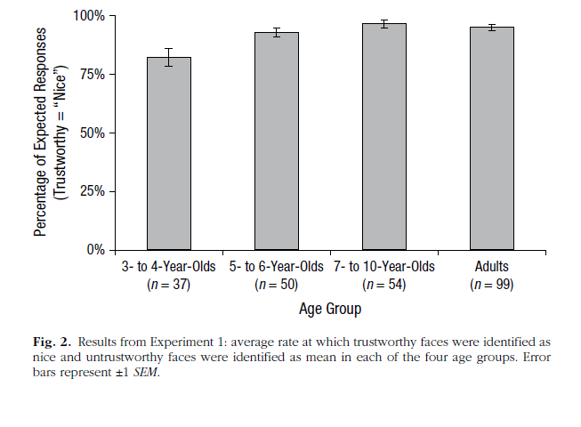
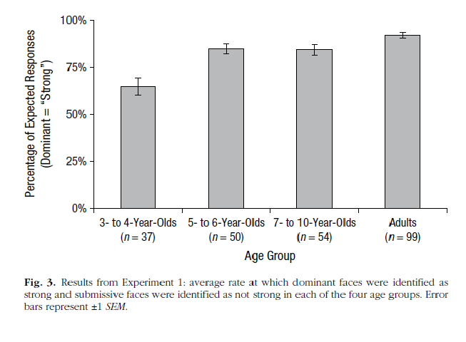
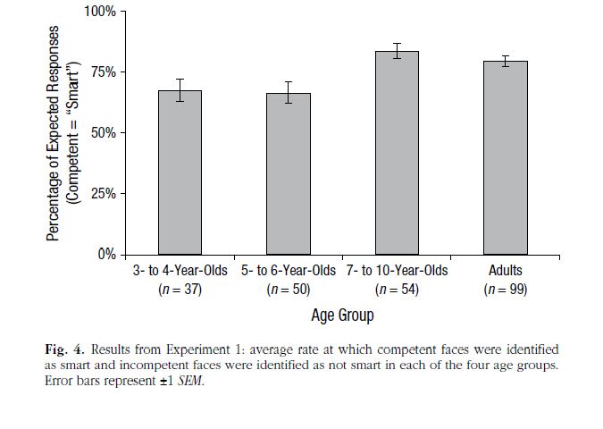

#### Article ID: 9-5-2015
#### Pilot 1: Kari Leibowitz
#### Co-pilot: Yochai Shavit
#### Start date: 11/1/17
#### End date: 11/5/17 

-------

#### Methods summary: 
In the present study, Cogsdill et al. presented participants in four age groups (3-4 year olds (n=37), 5-6 year olds(n=50), 7-10 year olds (n=54)- tested in lab or at a local museum and adults (n=99, tested online)) with pairs of faces that were pre-determined to be high (+3 s.d) or low (-3 s.d) in three traits: trustworthiness (measured as nice vs. mean), competence (measured as smart vs. not smart), or dominance (measured as strong vs. not strong). For each trait, 3 "high on trait" and 3 "loe on trait" faces were selected and each pairconsisted of one face was a "high on trait" face and the other a "low on trait" face. All possible 9 iterations were presented to participants in a counter balanced order across traits. 

The authors assessed the ability of each age group's members to accurately identify which of two faces was high in a particular trait, by asking participants to indicate which of these two peopke is very nice/strong/smart. The authors were interested in the consistency of judgements across age groups in terms of the ability to "correctly" identify traits of faces based on a pre-determined consensus. 

------

#### Target outcomes: 

For this article we focused on the findings reported in the results section of Experiment 1.

Specifically, we should attempted to reproduce all descriptive and inferential analyses reported in the text below and associated tables/figures (broken down by procedure):

> Figures 2, 3, and 4 summarize results for all age groups and traits; higher percentages of expected responses (i.e., those predicted on the basis of prior data--e.g., that trustworthy faces would be identified as nice and untrustworthy faces as mean) indicate stronger consensus.

> Combined, all four age groups showed significant consensus compared with chance (50%) when identifying faces as mean or nice (93%; Fig. 2), strong or not strong (85%; Fig. 3), and smart or not smart (76%; Fig. 4).

> Critically, all age groups attributed all three traits with significant consensus, ps < .001, ds > 1.08. 

> However, an analysis of variance (ANOVA) revealed a significant main effect of age group, F(3, 236) = 17.91, p < .001. Although 3- to 4-year-olds responded with robust and adult like consensus (72% across all traits), they were less consistent than 5- to 6-year-olds (81%), 7- to 10-year-olds (88%), and adults (89%). 

> One-way ANOVAs followed by post hoc tests with Sidak corrections for multiple comparisons were used to analyze age differences for each trait. These analyses revealed that when attributing both trustworthiness and dominance, 3- to 4-year-olds were less consistent than all other age groups (all ps < .01, ds > 0.59), which exhibited equivalent consistency (all ps > .23, ds < 0.40).


------

```{r global_options, include=FALSE}
knitr::opts_chunk$set(echo=TRUE, warning=FALSE, message=FALSE)
```

## Step 1: Load packages

```{r}
library(tidyverse) # for data munging
library(knitr) # for kable table formating
library(haven) # import and export 'SPSS', 'Stata' and 'SAS' Files
library(readxl) # import excel files
library(CARPSreports) # custom report functions
library(effsize) #used to calculate effect size
library(dunn.test)#used to do post hoc comparisons with Sidak's correction
library(car)
library(lsr) #using this to get effect sizes
library(broom)
```

## Step 2: Load data

```{r}
#setwd("~/Desktop/251")
#d<- read.csv("CARPS_9-5-2014_PS/data/Cogsdill_FaceTrait_Experiment1Public_04Feb14.csv")
d=read_xlsx("Cogsdill_FaceTrait_Experiment1Public_04Feb14.xlsx")
#head(d)
```

## Step 3: Tidy data

Want to gather data into age groups for each variable 
```{r}

dtidy <- select(d, age_grp='Age Group', 'NICE', 'SMART', 'STRONG') 

dtidy2 <- dtidy %>%
  gather(Attribute, Rating, -age_grp)

summarised <- summarise(group_by(dtidy2, age_grp, Attribute, add=TRUE), mean=mean(Rating, na.rm=T), sd=sd(Rating, na.rm=T), n=n(), se=sd/sqrt(n))

```

## Step 4: Run analysis

### Descriptive statistics

#### Figure 2 and associated data: NICE

Here recreating Figure 2, a bar graph of percentage of expected responses for niceness
```{r figure 2}

dnice <- summarised %>%
  filter(Attribute=="NICE")

fig.2=ggplot(data=dnice, aes(x=age_grp, y=mean, width=0.5)) +
    geom_bar(stat="summary", fun.y="mean", position="dodge", fill="grey", color="black") +
  geom_errorbar(aes(ymin=mean-se, ymax=mean+se), width=0.2)+
  ylim(0,1)+
  theme_bw()+
  labs(x="Age Group", y="Percent expected responses (Trustworthy='Nice')")+
  ggtitle("figure 2 reproduced: 'nice' by Age group")

```

**Comparing "nice" percentages per group**

*original*


```{r echo=F}
print(fig.2)
```


Replicating this finding:

> "Combined, all four age groups showed significant consensus compared with chance (50%) when identifying faces as mean or nice (93%; Fig. 2)... Cogsdill et al., page 1134"

```{r niceness average}

mean_nice=mean(dtidy$NICE, na.rm=T)

```
Mean = `r round(mean_nice*100, 0)`%, consistent with paper's finding

However, **The authors did not report which test they used to come up with the conclusion that this percentage is significantly different from 50%** [INSUFFICIENT INFORMATION error]. 

```{r, echo=F}
insuf=1
```

The test that seem to make the most sense to us is a one-sample t-test for the mean percent correct across groups, when subtracting 0.5 from each individual's score. That is because the one-sample test compare a mean against 0 and we want to compare against 0.5 (i.e 50%). We chose to run a two-sided test because the authors do not specify a direction in the analysis they used.

```{r one-sample t test aginst 0.5-nice}
# add varaibles for percent correct -0.5 for all traits in dtidy
dtidy=dtidy%>%mutate(NICE.5=NICE-0.5,SMART.5=SMART-0.5, STRONG.5=STRONG-0.5)

# run one-sample t test aginst zero on this variable (for nice)
t.nice=t.test(dtidy$NICE.5, alternative = "two.sided")
```

our t-test all revealed significant difference from-0, indicating that this trait was judged correctly more than 50% of the time across all age groups (t(`r t.nice$parameter`)=`r round(t.nice$statistic, 2)`, *p*=`r round(t.nice$p.value, 3)`).

**One-way t-test for "nice or mean"**
`r kable(tidy(t.nice), digits=3, caption="one-way t-test to compare mean 'nice' consensus minus 0.5 against 0")`

*note- this is equvilant of comparing the mean 'strong' consensus against 50%*

#### Figure 3 and associated data: STRONG

Here recreating Figure 3, a bar graph of percentage of expected responses for strength/submissiveness
```{r figure 3}

dstrong <- summarised %>%
  filter(Attribute=="STRONG")

fig.3=ggplot(data=dstrong, aes(x=age_grp, y=mean, width=0.5)) +
    geom_bar(stat="summary", fun.y="mean", position="dodge", fill="grey", color="black") +
  geom_errorbar(aes(ymin=mean-se, ymax=mean+se), width=0.2)+
  ylim(0,1)+
  theme_bw()+
  labs(x="Age Group", y="Percent expected responses (Dominant='Nice')")+
  ggtitle("figure 2 reproduced: 'strong' by Age group")

```

**Comparing "strong" percentages per group**

*original*


```{r echo=F}
print(fig.3)
```


Replicating this finding:

> "Combined, all four age groups showed significant consensus compared with chance (50%) when identifying faces as...strong or not strong (85%; Fig. 3)... Cogsdill et al., page 1134"

```{r niceness average 2}

mean_strong=mean(dtidy$STRONG, na.rm=T)

```
Mean = `r round(mean_strong*100,0)`%, consistent with paper's finding

We used the same approach detailed above to determine whether this mean percent correct is significantly different from 50%

```{r one-sample t test aginst 0.5-strong}
# run one-sample t test aginst zero on this variable (for nice)
t.strong=t.test(dtidy$STRONG.5, alternative = "two.sided")
```

our t-test all revealed significant difference from-0, indicating that this trait was judged correctly more than 50% of the time across all age groups (t(`r t.strong$parameter`)=`r round(t.strong$statistic, 2)`, *p*=`r round(t.strong$p.value, 3)`).

**One-way t-test for "strong or not-strong"**
`r kable(tidy(t.strong), digits=3, caption="one-way t-test to compare mean 'strong' consensus minus 0.5 against 0")`

*note- this is equvilant of comparing the mean 'strong' consensus against 50%*

#### Figure 4 and associated data: SMART

```{r figure 4}

dsmart <- summarised %>%
  filter(Attribute=="SMART")

fig.4=ggplot(data=dsmart, aes(x=age_grp, y=mean, width=0.5)) +
    geom_bar(stat="summary", fun.y="mean", position="dodge", fill="grey", color="black") +
  geom_errorbar(aes(ymin=mean-se, ymax=mean+se), width=0.2)+
  ylim(0,1)+
  theme_bw()+
  labs(x="Age Group", y="Percent expected responses (Competent='Smart')")+
  ggtitle("figure 2 reproduced: 'smart' by Age group")
```

**Comparing "smart" percentages per group**

*original*


```{r echo=F}
print(fig.4)
```


Replicating this finding:

> "Combined, all four age groups showed significant consensus compared with chance (50%) when identifying faces as...smart or not smart (76%; Fig. 4). Cogsdill et al., page 1134"

```{r smartness average}

mean_smart=mean(dtidy$SMART, na.rm=T)

```

Mean = `r round(mean_smart*100,0)`%, consistent with paper's finding

We used the same approach detailed above to determine whether this mean percent correct is significantly different from 50%

```{r one-sample t test aginst 0.5- smart}
# run one-sample t test aginst zero on this variable (for nice)
t.smart=t.test(dtidy$SMART.5, alternative = "two.sided")
```

our t-test all revealed significant difference from-0, indicating that this trait was judged correctly more than 50% of the time across all age groups (t(`r t.smart$parameter`)=`r round(t.smart$statistic, 2)`, *p*=`r round(t.smart$p.value, 3)`).

**One-way t-test for "smart or not smart"**
`r kable(tidy(t.smart), digits=3, caption="one-way t-test to compare mean 'smart' consensus minus 0.5 against 0")`

*note- this is equvilant of comparing the mean 'smart' consensus against 50%*


#### Checking consistency across age groups

> "Although 3- to 4-year-olds responded with robust and adult like consensus (72% across all traits), they were less consistent than 5- to 6-year-olds (81%), 7- to 10-year-olds (88%), and adults (89%). Cogsdill et al., page 1134"

```{r consistency by age group across traits}

d3_4 <- dtidy2 %>%
  filter(age_grp=="3-4 year olds")
mean_34=mean(d3_4$Rating)

d5_6 <- dtidy2 %>%
  filter(age_grp=="5-6 year olds")
mean_56=mean(d5_6$Rating)

d7_10 <- dtidy2 %>%
  filter(age_grp=="7-10 year olds")
mean_710=mean(d7_10$Rating)

dadults <- dtidy2 %>%
  filter(age_grp=="Adults")
mean_adults=mean(dadults$Rating)
```

Average across 3-4 year olds: `r round(mean_34*100,0)`%
Average across 5-6 year olds: `r round(mean_56*100,0)`%
Average across 7-10 year olds: `r round(mean_710*100,0)`%
Average across adults: `r round(mean_adults*100,0)`%
All consistent with statistics reported in paper 

### Inferential statistics


#### Replicating consensus

Relicating this finding:

> "Combined, all four age groups showed significant consensus compared with chance (50%) when identifying faces as mean or nice , strong or not strong, and smart or not smart."

#####INSUFFICIENT INFORMATION ERROR.

(reported above in *'descriptive statistics'*)

We attempted to replicate this finding using our best guess of what test to use, but after calculating this realized that this probably entailed "lengthy guesswork" on our part. Thus, we have marked this as an insufficient information error but also included the tests we attempted to run below. In addition to the one-sample t-tests detailed as part of the descriptive statistics, we took an additional approach as a way to verify our initial results.

Looking at all four age groups combined for each of the three attributes. Here, we are using a chi squared test to compare the number of correct trials to the number of incorrect trials, although the authors do not specify exactly what statistical test was used to identify this concensus, so this is another guess as to what test was used. 

All ps<.001, consistent with author's finding.
```{r consensus compared with chance}

#multiplying each response by 9 since there were 9 trials, using that to compute # of correct and incorrect, inputting correct vs. incorrect into chi square test 
d$nice_correct <- round(9*d$NICE,0)
d$nice_wrong <- (9-d$nice_correct)
sum_n_cr=sum(d$nice_correct) #2007
sum_n_wr=sum(d$nice_wrong) #153
chi1=chisq.test(x=c(2007, 153))
#p<.001

d$smart_correct <- round(9*d$SMART,0)
d$smart_wrong <- (9-d$smart_correct)
sum_sm_cr=sum(d$smart_correct) #1641
sum_sm_wr=sum(d$smart_wrong) #519
chi2=chisq.test(x=c(1641, 519))
#p<.001

d$strong_correct <- round(9*d$STRONG,0)
d$strong_wrong <- (9-d$strong_correct)
sum_st_cr=sum(d$strong_correct) #1828
sum_st_wr=sum(d$strong_wrong) #332
chi3=chisq.test(x=c(1828, 332))
#p<.001

```

All $\chi^2$ goodness-of-fit tests yielded significant results. Our findings are detailed in the tables below:

*"Nice"*:

`r kable(tidy(chi1), digits=3, caption="chi-squre goodness-of-fit test, correct 'nice' responses compared to chance")`

*"Smart"*:

`r kable(tidy(chi2), digits=3, caption="chi-squre goodness-of-fit test, correct 'smart' responses compared to chance")`

*"Strong"*:

`r kable(tidy(chi3), digits=3, caption="chi-squre goodness-of-fit test, correct 'strong' responses compared to chance")`


We then turned to replicate this finding:

> "Critically, all age groups attributed all three traits with significant consensus, ps < .001, ds > 1.08. from Cogsdill et al. page 1134"


#####INSUFFICIENT INFORMATION ERROR.

```{r echo=F}
insuf=insuf+1

```

We attempted to replicate this finding using our best guess of what test to use, but after calculating this realized that this probably entailed "lengthy guesswork" on our part. Thus, we have marked this as an insufficient information error but also included the tests we attempted to run below. 

Note: the authors don't specify what analytical test was used to determine consensus across age groups and there is some ambiguity in the phrasing here. We took this to mean that within each age group, ratings for each of the three attributes (nice, smart, strong) were consistent. In order to examine this, we looked at t tests and effect sizes for the percentage of correct and incorrect identifications using the "overall" variable across all attributes within each age group. However, it is unclear from the manuscript whether this was the correct approach. We also took an alternative approach, interpreting "consensus" as percent overall greater than 50%. 

The paper also indicates that all ps <.001 and all ds>1.08. Using this method, we found that all ps were indeed < .001, but found that our smallest d was 1.42, indicating a potential discrepency between our findings and the paper's findings. However, without more information, it is unclear whether this discrepancy represents an error on our part or the part of the original authors, or simply that we did not replicate the same method described in the paper.


```{r overall}
## Correct vs. Incorrect

#creating a variable for overall percentage of wrong identifications
dtidy$OVERALL=d$OVERALL
dtidy$overall_wrong <- (1-dtidy$OVERALL)

#looking at t test for correct vs. incorrect trials over all 3 attributes for 3 to 4 year olds
d3_4overall <- dtidy %>%
  filter(age_grp=="3-4 year olds")
t_34=t.test(d3_4overall$OVERALL, d3_4overall$overall_wrong, paired=T)
cohen_34=cohen.d(d3_4overall$OVERALL, d3_4overall$overall_wrong, paired=T)
#p<.001, d=1.42

#looking at t test for correct vs. incorrect trials over all 3 attributes for 5 to 6 year olds
d5_6overall <- dtidy %>%
  filter(age_grp=="5-6 year olds")
t_56=t.test(d5_6overall$OVERALL, d5_6overall$overall_wrong, paired=T)
cohen_56=cohen.d(d5_6overall$OVERALL, d5_6overall$overall_wrong, paired=T)
#p<.001, d=2.37

#looking at t test for correct vs. incorrect trials over all 3 attributes for 7 to 10 year olds
d7_10overall <- dtidy %>%
  filter(age_grp=="7-10 year olds")
t_710=t.test(d7_10overall$OVERALL, d7_10overall$overall_wrong, paired=T)
cohen_710=cohen.d(d7_10overall$OVERALL, d7_10overall$overall_wrong, paired=T)
#p<.001, d=2.91

#looking at t test for correct vs. incorrect trials over all 3 attributes for adults
dadultoverall <- dtidy %>%
  filter(age_grp=="Adults")
t_adults=t.test(dadultoverall$OVERALL, dadultoverall$overall_wrong, paired=T)
cohen_adults=cohen.d(dadultoverall$OVERALL, dadultoverall$overall_wrong, paired=T)
#p<.001, d=3.19

p_values=c(t_34$p.value, t_56$p.value, t_710$p.value, t_adults$p.value)
ds=c(cohen_34$estimate, cohen_56$estimate, cohen_710$estimate, cohen_adults$estimate)

## One-sample, overall-0.5
dtidy$OVERALL.5=dtidy$OVERALL-0.5

#Overall -0.5 for 3-4 year olds
t34.b=with(dtidy%>%filter(age_grp=="3-4 year olds"),
           t.test(OVERALL.5, alternative = "two.sided"))
d34.b=with(dtidy%>%filter(age_grp=="3-4 year olds"),
           cohensD(OVERALL.5))

#Overall -0.5 for 5-6 year olds
t56.b=with(dtidy%>%filter(age_grp=="5-6 year olds"),
           t.test(OVERALL.5, alternative = "two.sided"))
d56.b=with(dtidy%>%filter(age_grp=="5-6 year olds"),
           cohensD(OVERALL.5))

#Overall -0.5 for 7-10 year olds
t710.b=with(dtidy%>%filter(age_grp=="7-10 year olds"),
           t.test(OVERALL.5, alternative = "two.sided"))
d710.b=with(dtidy%>%filter(age_grp=="7-10 year olds"),
           cohensD(OVERALL.5))

#Overall -0.5 for adults
tadults.b=with(dtidy%>%filter(age_grp=="Adults"),
           t.test(OVERALL.5, alternative = "two.sided"))
dadults.b=with(dtidy%>%filter(age_grp=="Adults"),
           cohensD(OVERALL.5))

p_values.b=c(t34.b$p.value, t56.b$p.value, t710.b$p.value, tadults.b$p.value)
ds.b=c(d34.b, d56.b, d710.b, dadults.b)
```

The two methods are equivalent for all intents and purposes of this report. 
```{r}
p_values==p_values.b
ds==ds.b
```

Our replication efforts revealed that the minimal p-value = `r round(min(p_values), 3)` which is smaller then 0.001, thus consistent with the article's report. 

However, the minimal *d* in our replication = `r round(min(ds), 2)` which is larger than the reported minimal cohen's d (1.08).

CARPS report: `r compareValues(reportedValue = 1.08, obtainedValue = 1.41)`

```{r echo=F}
major_er=1
```


We next turned to replicate this finding:
> "However, an analysis of variance (ANOVA) revealed a significant main effect of age group, F(3, 236) = 17.91, p < .001. Cogsdill et al., page 1134"

Our results are overall consistent with this finding.

```{r}

anova1=aov(OVERALL ~ age_grp, data=dtidy)
#F(3, 236) = 17.95, p<.001

```

`r kable(tidy(anova1), digits=2, caption="ANOVA to compare group means on overall percent correct")`

We did find one inconsistency in the reported F-statistic's value (a *minor* numerical error).
CARPS report: `r compareValues(reportedValue = 17.91, obtainedValue = 17.95)`


We then attempted to replicate this finding:

> "One-way ANOVAs followed by post hoc tests with Sidak corrections for multiple comparisons were used to analyze age differences for each trait. These analyses revealed that when attributing both trustworthiness and dominance, 3- to 4-year-olds were less consistent than all other age groups (all ps < .01, ds > 0.59), which exhibited equivalent consistency (all ps > .23, ds < 0.40). Cogsdill et al., page 1134"


```{r final anovas}

#running anova for nice
aovnice <- aov(NICE ~ `Age Group`, data=d)
summary(aovnice)

#running dunn test to try and compare sidak correction for #nice
dunn.test(d$NICE, d$`Age Group`, method="sidak")
#according to this we get a different output from the authors - that there is no difference between 5-6 year olds and 3-4 year olds

#running anova for smart
summary(aov(d$SMART ~ d$`Age Group`)) #this is not mentioned
dunn.test(d$SMART, d$`Age Group`, method="sidak") #3-4 year olds not different than 5-6 yera olds; probably why this attribute is not mentioned

#running anova for strong
aovstrong <- aov(STRONG~`Age Group`, data=d)
summary(aovstrong)

#running dunn test to try and compare sidak correction for strong
dunn.test(d$STRONG, d$`Age Group`, method="sidak")
#according to this we get the same outcome as the authors, that 3-4 year olds were less consistent than other age groups (all ps <.01) 

```

**Trustworthyness**

Inconsistency 1: When attributing trustworthiness, we did not find a difference between the consistency of 3-4 year olds and 5-6 year olds. (p=.0465) 

CARPS report: `r compareValues(reportedValue = 0.01, obtainedValue = 0.0465, isP=T)`

Inconsistency 2: When looking at the consistency of all other groups "which exhibited equivalent consistency (all ps>.23)" for trustworthiness, we found a significant difference between the 5-6 year olds and the 7-10 year olds, p=.0378. 
>We are not sure if this was not marked as significant because of the Sidak correction for multiple comparisons, but it does not equal 0.23 or greater. 

CARPS report: `r compareValues(reportedValue = 0.23, obtainedValue = 0.0378, isP=T)`

**Dominance**

Inconsistency 3: When looking at the attribute of dominance, we found that the 5-6 year olds were significantly different than the adults (p=.0047) and that the 7-10 year olds compared to the adults had a p=.0532, which again is inconsistent with what the authors stated. 

*5-6 year olds compared to adults*- CARPS report: `r compareValues(reportedValue = 0.23, obtainedValue = 0.0047, isP=T)`

*7-10 year olds compared to adults*- CARPS report: `r compareValues(reportedValue = 0.23, obtainedValue = 0.0532, isP=T)`

It is unclear to us whether these inconsistencies are a) a result of running this test in R using the 'dunn.test' package as opposed to in another software; b) due to replicator error in calculating or interpreting outputs or; c) indicative of true errors.


Looking at effect sizes:
> "These analyses revealed that when attributing both trustworthiness and dominance, 3- to 4-year-olds were less consistent than all other age groups (all ps < .01, ds > 0.59), which exhibited equivalent consistency (all ps > .23, ds < 0.40)."

####INSUFFICIENT INFORMATION ERROR 

```{r}
insuf=insuf+1
```


Here, we run into the same issue we ran into before: without more information about which specific tests were used to calculate "consistency," we would need to engage in "lengthy guesswork" to determine what tests to use. However, since the authors report effect sizes using Cohen's d, which is the effect size for t-test, and since these effect sizes do not depend on correction of p.values, we proceeded (with caution) to obtain Cohen's d comparing 3-4 year olds means for percent correct on 'trustworthiness' and 'dominance' with those of all other age groups.

```{r}
## comparing 3-4 year olds to all other age groups
# 3-4 vs. 5-6
d_3456=d%>%filter(`Age Group`=="3-4 year olds" | `Age Group`=="5-6 year olds")
dn_3456=cohensD(d_3456$NICE~d_3456$`Age Group`) #-> effect size for nice, d=0.602
dd_3456=cohensD(d_3456$STRONG~d_3456$`Age Group`) #-> effect size for strong, d=0.861

# 3-4 vs. 7-10
d_34710=d%>%filter(`Age Group`=="3-4 year olds" | `Age Group`=="7-10 year olds")
dn_34710=cohensD(d_34710$NICE~d_34710$`Age Group`) #-> effect size for nice, d=0.832
dd_34710=cohensD(d_34710$STRONG~d_34710$`Age Group`) #-> effect size for strong, d=0.795

# 3-4 vs. adults
d_34ad=d%>%filter(`Age Group`=="3-4 year olds" | `Age Group`=="Adults")
dn_34ad=cohensD(d_34ad$NICE~d_34ad$`Age Group`) #-> effect size for nice, d=0.766
dd_34ad=cohensD(d_34ad$STRONG~d_34ad$`Age Group`) #-> effect size for strong, d=1.376

ds_34=c(dn_3456, dn_34710, dn_34ad, dd_3456, dd_34710, dd_34ad)

## comparing all other age groups to one another
# 5-6 vs. 7-10
d_56710=d%>%filter(`Age Group`=="5-6 year olds" | `Age Group`=="7-10 year olds")
dn_56710=cohensD(d_56710$NICE~d_56710$`Age Group`) #-> effect size for nice, d=0.301
dd_56710=cohensD(d_56710$STRONG~d_56710$`Age Group`) #-> effect size for strong, d=0.026

# 5-6 vs. adults
d_56ad=d%>%filter(`Age Group`=="5-6 year olds" | `Age Group`=="Adults")
dn_56ad=cohensD(d_56ad$NICE~d_56ad$`Age Group`) #-> effect size for nice, d=0.157
dd_56ad=cohensD(d_56ad$STRONG~d_56ad$`Age Group`) #-> effect size for strong, d=0.421

# 7-10 vs. adults
d_710ad=d%>%filter(`Age Group`=="7-10 year olds" | `Age Group`=="Adults")
dn_710ad=cohensD(d_710ad$NICE~d_710ad$`Age Group`) #-> effect size for nice, d=0.1197
dd_710ad=cohensD(d_710ad$STRONG~d_710ad$`Age Group`) #-> effect size for strong, d=0.422

ds_other=c(dn_56710, dn_56ad, dn_710ad, dd_56710, dd_56ad, dd_710ad)
```


We found that The minimal effect size for 3-4 year olds' percent correct vs. that of any other age group's on either trait, is `r round(min(ds_34), 3)`. This effect size is slightly larger than that reported by Cogsdill et al (0.59). However, this does not seem to be a major error.

CARPS report: `r compareValues(reportedValue = 0.59, obtainedValue = 0.602)`

Similarly, we found that the maximal effect size comparing all other age groups to one another is slightly larger- d=`r round(max(ds_other),3)`. However, the authors may have rounded the same value down.

CARPS report: `r compareValues(reportedValue = 0.40, obtainedValue = 0.422)`


## Step 5: Conclusion


```{r}

carpsReport(Report_Type = "pilot", 
             Article_ID = "CARPS-9-5-2014", 
             Insufficient_Information_Errors = 3, 
             Decision_Errors = 3, 
             Major_Numerical_Errors = 4, 
             Time_to_Complete = 300, 
             Author_Assistance = FALSE)
```

All of the descriptive findings and figures we attempted to replicate were consistent with the original author's report. The major errors in this paper concerned insufficient information in terms of how "consistency" betweena and across age groups was calculated. Additional errors found were decision errors and major numerical errors in regards to the pooled summaries of differences across groups. 

```{r session_info, include=TRUE, echo=TRUE, results='markup'}
devtools::session_info()
```
